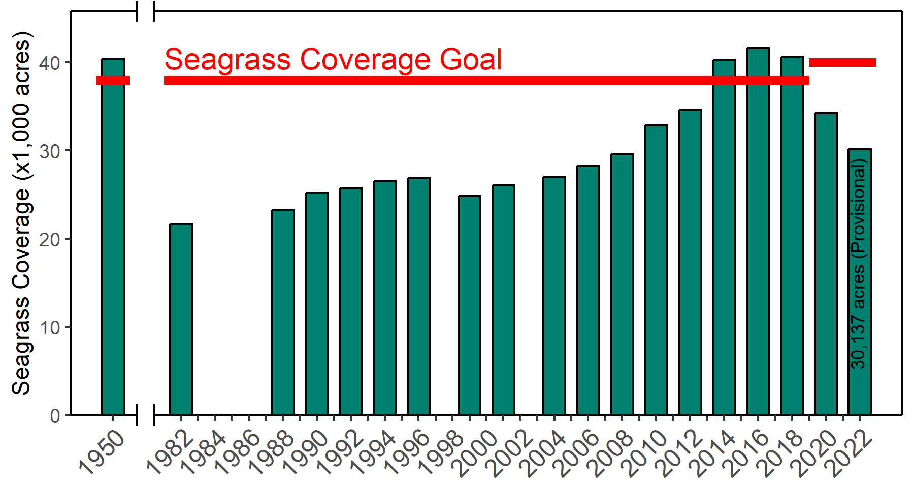

```{r setup, message = F, warning = F, results = 'hide', echo = F}
knitr::opts_chunk$set(echo = F, warning = F, message = F, fig.path = 'figure/')

library(tbeptools)
library(extrafont)
library(tidyverse)
library(reactable)
library(gridExtra)
library(grid)
library(english)
library(here)
library(ggfx)
# library(googlesheets4)

source('R/funcs.R')

loadfonts(device = 'pdf', quiet = T)
font_import()
if(Sys.info()[1] == 'Windows')
  loadfonts(device = 'win', quiet = T)

# # style file
# styles <- readLines('https://raw.githubusercontent.com/tbep-tech/css-styling/master/styles.css')
# writeLines(styles, 'styles.css')

levs <- c('Old Tampa Bay', 'Hillsborough Bay', 'Middle Tampa Bay', 'Lower Tampa Bay')
noaa_key <- Sys.getenv('NOAA_KEY')
maxyr <- 2022
fml <- NA

# # get refs file
# options(gargle_oauth_email = "mbeck@tbep.org")
# path <- 'https://docs.google.com/spreadsheets/d/1VvEFlD_dRhp26HeOMz-CyZ5ZG9szMCziBBcniCwrUJg/edit?usp=sharing'
# sht <- read_sheet(path)
# sht <- as.data.frame(sht)
# shtsv <- mutate_all(sht, as.character)
# write.csv(shtsv, 'tbep-refs.csv', row.names = F)
# bibs <- anlz_refs(sht)
# writeLines(bibs, 'bibs.bib')

data(wqdat)
```

<center><h1 style="font-size:180%">THE TAMPA BAY NITROGEN MANAGEMENT CONSORTIUM PARTNERSHIP FOR PROGRESS<h1></center>

<table>
  <col width="100">
  <tr>
    <td>TO:</td>
    <td>Adam Blalock, FDEP</td>
  </tr>
  <tr>
    <td></td>
    <td>Daniel Blackman, US EPA Region 4</td>
  </tr>
  <tr>
    <td>FROM:</td>
    <td>Ed Sherwood, TBEP Executive Director (NMC Facilitator)</td>
  </tr>
  <tr>
    <td>DATE:</td>
    <td>`r Sys.Date()`</td>
  </tr>
  <tr>
    <td>SUBJECT:</td>
    <td>`r maxyr` Tampa Bay Nutrient Management Compliance Assessment Results</td>
  </tr>
  <tr>
    <td><font size="2">cc:</font></td>
    <td><font size="2">Ken Weaver, Jessica Mostyn, Ben Ralys, Kevin O’Donnell, Kimberly Shugar (FDEP Tallahassee)</font></td>
  </tr>
    <tr>
    <td></td>
    <td><font size="2">Ramandeep Kaur, Vishwas Sathe, Jessica Pein, Astrid Flores Thiebaud (FDEP Tampa)</font></td>
  </tr>
    <tr>
    <td></td>
    <td><font size="2">Jeaneanne M. Gettle, Wade Lehmann, Jeffrey Lerner, Nancy Laurson, Felicia Burks, Tom McGill (EPA Region 4/HQ)</font></td>
  </tr>
    <tr>
    <td></td>
    <td><font size="2">Jeff Greenwell, Santino Provenzano, Tony Janicki, Ray Pribble (TBNMC)</font></td>
  </tr>
    <tr>
    <td></td>
    <td><font size="2">Ed Sherwood, Maya Burke, Marcus Beck (TBEP)</font></td>
  </tr>
<table>
<br></br>

Source content: [here](https://github.com/tbep-tech/tbnmc-compliance-assessment-2022)

On behalf of the Tampa Bay Nitrogen Management Consortium, please find attached the 2022 update on water quality and seagrass resources in the Tampa Bay estuary. This update has been developed in accordance with the compliance assessment adopted through ([FDEP’s Tampa Bay Reasonable Assurance determination on December 22, 2010](https://drive.google.com/file/d/1wV3w8ack_fLNK3yS-xTR7LTmziNtZ8CN/view?usp=share_link)), FDEP’s subsequent approval of the ([2022 RA Update](https://drive.google.com/file/d/1IIloBN5RoZPB6vgWzEjmMQyFjFL3fq0Y/view?usp=share_link)), and the ([federally-recognized TMDL for Tampa Bay](https://drive.google.com/file/d/18_W1qKT2I0j9m0mLC7wWjndSNR-0iWEF/view?usp=share_link)). The formal annual compliance assessment utilized by the Consortium is detailed in Section VIII.B of the ([Final 2009 Reasonable Assurance Addendum: Allocation and Assessment Report](https://drive.google.com/file/d/10IjJAfcGFf007a5VdPXAUtUi4dx-cmsA/view)).

Chlorophyll-a concentrations for all four major bay segments were below FDEP-approved numeric nutrient criteria thresholds in 2022. The approved chlorophyll-a thresholds were adopted as part of FDEP’s 2002 Reasonable Assurance determination for Tampa Bay, and, at that time, it was determined that Tampa Bay’s seagrass restoration goals could be achieved if annual, uncorrected chlorophyll-a concentrations remained below these thresholds. If a bay segment’s chlorophyll-a concentration remains above thresholds for 2 concurrent years, additional compliance assessment steps are required by the Consortium. This nutrient management strategy has been consistently used by the TBEP and Consortium in their Annual Decision Matrix and Assessment reports [@tbep0323].

Seagrass coverage in Tampa Bay decreased between 2020 and 2022 (prior to the reported chlorophyll-a conditions detailed above). The Southwest Florida Water Management District's (SWFWMD) 2022 baywide seagrass coverage estimate is 30,137 acres, remaining below the baywide target of 40,000 acres (Figure \@ref(fig:seagrass)). The 2022 estimate marks the third consecutive reporting period with a reduction of seagrass coverage in Tampa Bay. Losses were primarily observed in upper bay segments and additional research, assimilative capacity assessments, and restoration initiatives are being conducted in response to these trends. Notwithstanding these setbacks, the Consortium’s approved nutrient management strategy is still required to adaptively manage and address nutrient loading to the Tampa Bay estuary. For the other Tampa Bay segments, water quality remained supportive of seagrass resources, though baywide seagrass losses continue to be examined.

Thank you again for your continued participation in the Consortium’s process.  Please contact Ed Sherwood ([esherwood@tbep.org](mailto:esherwood@tbep.org)) with any questions about the Consortium’s Annual Compliance Assessment.

<center><h1 style="font-size:180%">`r maxyr` Tampa Bay Estuary Nutrient Management Compliance Assessment</h1></center>

On December 22, 2010, then FDEP Secretary Drew signed a Final Order ([FDEP 2010](https://drive.google.com/file/d/1wV3w8ack_fLNK3yS-xTR7LTmziNtZ8CN/view?usp=share_link)) accepting and approving the 2009 Reasonable Assurance (RA; [TBNMC 2010](https://drive.google.com/file/d/10IjJAfcGFf007a5VdPXAUtUi4dx-cmsA/view?usp=drivesdk)) Addendum for the Tampa Bay estuary. The final order found that the Nitrogen Management Consortium (NMC) provided FDEP reasonable assurance that: 1) completed and proposed management actions in the 2009 RA Addendum will result in the continued attainment of the estuarine nutrient criteria within Tampa Bay, and 2) compliance with the allocations in the 2009 RA Addendum ensures reasonable progress towards continued attainment of the estuarine nutrient criteria and associated Class III designated uses. Furthermore, the FDEP finalized a WQBEL for the Tampa Bay estuary in accordance with the allocations developed under the 2009 RA Addendum in November 2010. The Consortium completed subsequent RA Updates in  [2012](https://tbep.org/reasonable-assurance-plans-updates-2012/), [2017](https://tbep.org/reasonable-assurance-plans-updates-2017/), and 2022 maintaining allocations and expanding upon projects originally defined in the [2002 RA Submittal](https://tbep.org/reasonable-assurance-plans-updates-2002/), [2007 RA Update](https://tbep.org/reasonable-assurance-plans-updates-2007/), [2009 RA Addendum](https://drive.google.com/file/d/10IjJAfcGFf007a5VdPXAUtUi4dx-cmsA/view?usp=drivesdk), [2012 RA Update](https://drive.google.com/file/d/1F_QmQcvGVQ78wK3jcMLMGmjs1vJ21nto/view?usp=share_link), [2017 RA Update](https://drive.google.com/file/d/1VdYE67_aZAhFq6JYQSKxx2WY2O5KwyUI/view?usp=share_link) and [2022 RA Update](https://drive.google.com/file/d/18HHMx4U6vHNrFyepEFuoTJ_sEKyTA_gu/view?usp=share_link).

As part of the compliance assessment stipulated under the 2009 RA Addendum, the NMC committed to annually assess the water quality and seagrass conditions within Tampa Bay and annually report these to FDEP and EPA. The Consortium’s assessment responsibilities are shown in green in Figure \@ref(fig:decision). It should be noted that the Consortium’s reasonable assurance assessment strategy begins with the observation of water quality conditions in the bay for a particular year. As is recommended in numerous EPA guidance documents for the development of numeric nutrient criteria, the Consortium’s assessment strategy attempts to apply a stressor-response rationale for the determination of nitrogen load allocation reasonable assurance in the estuary.

```{r decision, fig.align = 'center', out.width = '70%', fig.cap='Nitrogen Management Consortium decision framework to assess future reasonable assurance of adopted allocations. Actions and steps to be conducted by the NMC are shown in the circles and diamonds. Steps, decision points, and actions are outlined in Table \\@ref(tab:steps) (below) according to the Roman numerals listed in the figure.'}
knitr::include_graphics(here::here('www/decisionframework.png'))
```

The framework is applied on a bay-segment basis, and is predicated on assessing annual attainment of the bay segment chlorophyll-a concentration threshold as the initial step. If the bay segment-specific chlorophyll-a threshold is met, the Consortium annually reports the results to FDEP and EPA and additional assessment steps are not required by the Consortium (by June of the following year). If annual average chlorophyll-a thresholds are not met in one or more bay segments, additional assessment steps are required by the Consortium as noted in the framework and assessment process (Figure \@ref(fig:decision), Table \@ref(tab:steps)).

Regardless of the assessment results, the Consortium will annually report (by June of the following year) whether the bay segment specific chlorophyll-a thresholds are met using the Environmental Protection Commission of Hillsborough County (EPCHC) dataset, as traditionally assessed using the "Decision Matrix" management strategy developed by the TBEP [@tbep0400] and will deliver this to FDEP and EPA (Figure \@ref(fig:decision); NMC Action 1 in the Framework). If an annual, individual exceedence of a bay segment chlorophyll-a threshold is observed, an addendum report outlining the anomalous event(s) or data which influenced the bay segment chlorophyll-a exceedence will be delivered to FDEP and EPA upon review by NMC participants by September of the following year (Figure \@ref(fig:decision); NMC Action 2 in the Framework). An evaluation of the bay segment assimilative capacity (i.e. revision to the federally-recognized TMDL) is formally considered (if not already considered by the NMC) when bay segment chlorophyll-a thresholds are not met in 2 concurrent years, and hydrologically normalized loads for those years meet the federally-recognized TMDL (Figure \@ref(fig:decision); NMC Action 3 in the Framework). This was the case for the Old Tampa Bay segment during the 2019-2021 period.  Alternatively, when bay segment chlorophyll-a thresholds are not met in 2 concurrent years and hydrologically normalized loads for those years also do not meet the federally-recognized TMDL, the Consortium will deliver a full loading report to FDEP and EPA comparing the observed, combined entity/source annual or multiple year loadings to the sources' 5-yr annual average allocation by September of the following year. This report will identify any exceedences among combined entity/source load categories after taking into consideration "set allocation" sources and hydrologically-normalized sources, and if necessary, whether exceedences were observed for individual MS4 or unpermitted (LA) sources (Figure \@ref(fig:decision); NMC Action 4 in the Framework). It is noted that FDEP will independently assess individual entities for compliance with their allocations.

<table border="1">
  <caption>(\#tab:steps) Assessment steps linked to the Nitrogen Management Consortium’s decision framework, as depicted in Figure \@ref(fig:decision).</caption>
  <col width = "600">
  <col width = "100">
  <col width = "200">
  <tr>
    <td><b>Assessment Step</b></td>
    <td style="text-align:center"><b>Result</b></td>
    <td style="text-align:center"><b>Action</b></td>
  </tr>
  <tr>
    <td rowspan="2"><b>I.</b> Determine annual bay segment specific chlorophyll-a FDEP threshold attainment as traditionally assessed using the Decision Matrix management strategy developed by the TBEP [@tbep0400].</td>
    <td style="text-align:center"><b>Yes</b></td>
    <td style="text-align:center"><b>NMC Action 1</b></td>
  </tr>
  <tr>
    <td style="text-align:center"><b>No</b></td>
    <td style="text-align:center"><b>NMC Action 1</b></td>
  </tr>
  <tr>
    <td rowspan="2"><b>II.</b> Review data and determine if an anomalous event(s) influenced non-attainment of the bay segment specific chlorophyll-a threshold.</td>
    <td style="text-align:center"><b>Yes</b></td>
    <td style="text-align:center"><b>NMC Action 2</b></td>
  </tr>
  <tr>
    <td style="text-align:center"><b>No</b></td>
    <td style="text-align:center"><b>Go to III</b></td>
  </tr>
  <tr>
    <td rowspan="2"><b>III.</b> Determine if the chlorophyll-a thresholds have been exceeded for <2 consecutive years.</td>
    <td style="text-align:center"><b>Yes</b></td>
    <td style="text-align:center"><b>NMC Action 2</b></td>
  </tr>
  <tr>
    <td style="text-align:center"><b>No</b></td>
    <td style="text-align:center"><b>Go to IV</b></td>
  </tr>
  <tr>
    <td rowspan="2"><b>IV.</b> Determine if the bay segment specific federally-recognized TMDL has been achieved using the hydrologically-adjusted compliance assessment outlined in NMC Decision Memo #11 (Appendix 2-11).</td>
    <td style="text-align:center"><b>Yes</b></td>
    <td style="text-align:center"><b>NMC Action 3</b></td>
  </tr>
  <tr>
    <td style="text-align:center"><b>No</b></td>
    <td style="text-align:center"><b>Go to V</b></td>
  </tr>
  <tr>
  <td><b>V.</b> For a given year or for multiple years, compile and report entity-specific combined source loads in comparison to 5-yr annual average reasonable assurance allocation.</td>
    <td style="text-align:center"><b>Compile & Report</b></td>
    <td style="text-align:center"><b>NMC Action 4</b></td>
  </tr>
</table>
<br></br>

NMC actions outlined in Figure \@ref(fig:decision) and Table \@ref(tab:steps) performed during RA Implementation Period (2022-2026) are as follows:

<table>
  <col width="100">
  <tr>
    <td valign="top">NMC Action 1 -</td>
    <td>A report assessing attainment of bay segment specific chlorophyll-a thresholds using the EPCHC dataset, as traditionally assessed using the Decision Matrix management strategy developed by the TBEP [@tbep0400] will be delivered to FDEP and EPA (this report).</td>
  </tr>
  <tr>
    <td valign="top">NMC Action 2 -</td>
    <td>A report of the anomalous event(s) or data which influenced the bay segment chlorophyll-a exceedence will be delivered to FDEP and EPA, upon review by NMC participants (this report).</td>
  </tr>
  <tr>
    <td valign="top">NMC Action 3 -</td>
    <td>Consider re-evaluation of the bay segment assimilative capacity based on nonattainment of bay segment chlorophyll-a threshold while meeting federally-recognized TMDL.</td>
  </tr>
  <tr>
    <td valign="top">NMC Action 4 -</td>
    <td>If federally-recognized TMDL not achieved, compile results of hydrologic evaluation for FDEP's review and identify potential further actions needed to achieve reasonable assurance for bay segment allocations. </td>
  </tr>
</table>

<center><h1 style="font-size:180%">`r maxyr` Results Summary</h1></center>

Results from 2022 indicate that all RA bay segments met chlorophyll-a thresholds accepted by the FDEP to maintain FDEP Reasonable Assurance for Tampa Bay and to comply with the EPA TMDL (Figure \@ref(fig:thrplot)) and estuarine numeric nutrient criteria for Tampa Bay ([EPA Amended Approval Letter Jun. 28, 2013](https://www.epa.gov/sites/default/files/2015-04/documents/florida-amended-determination.pdf)). The previous 2017-2021 RA period had four of the five years where Old Tampa Bay exceeded the chlorophyll-a threshold.  This 2022 annual assessment is the first in the last four years where chlorophyll-a threshold were met in Old Tampa Bay.  Regardless, water quality conditions in Old Tampa Bay remain a priority concern for the Consortium.  Chlorophyll-a concentrations are typically elevated in a poorly flushed region that has produced summertime blooms of *Pyrodinium bahamense* since 2009 (Figure \@ref(fig:sitemap); *Note that individual station exceedences are not considered in this RA compliance assessment*). This observation is reflected in the majority of summertime months with chlorophyll-a concentrations higher than long-term median values in Old Tampa Bay, although this was not observed in 2022 (Figure \@ref(fig:boxplot)). To address these water quality problems, the Consortium formed an Old Tampa Bay Working Group in early 2020 to prioritize additional investigations and future management actions that may alleviate the conditions fostering these summertime blooms. Additionally, the TBEP received funding from a NOAA Restore Actionable Science grant in 2021 to develop a research management plan for identifying potential actions to improve water quality conditions in Old Tampa Bay. The plan will be finalized in early 2023, and a grant proposal was submitted to NOAA for the next research phases outlined in the plan.

The TBEP, in partnership with the Southwest Florida Water Management District, has previously developed an integrated ecosystem model to evaluate the net environmental benefits that may result from implementing various management actions in Old Tampa Bay including: reducing point sources, nonpoint sources, and causeway obstructions in Old Tampa Bay [@tbep1015]. Management actions that proximate and respond to current Old Tampa Bay conditions will be further evaluated using this model. Furthermore, the TBEP is funding research conducted by the Florida Fish and Wildlife Research Institute to improve understanding of the cell physiology and behavior of *Pyrodinium bahamense* and evaluate the potential for using shellfish to mitigate these algal blooms in Old Tampa Bay.  A water quality dashboard ([https://shiny.tbep.org/wq-dash](https://shiny.tbep.org/wq-dash)) continues to be available to further synthesize available data, assess additional water quality metrics (phytoplankton counts), and inform Consortium participants and other resource managers on the status of water quality in Tampa Bay. The dashboard allows for proactive response to anomalous water quality conditions on a month-to-month basis by the community.

Seagrasses were relatively stable in much of Lower to Middle Tampa Bay; however, additional declines to the ephemeral seagrass beds in upper Tampa Bay were observed between 2020 and 2022. Aerial photographs taken in December 2021 - January 2022 indicated that baywide seagrass coverage decreased by 4,160 acres, marking the third consecutive biennial reporting period with seagrass declines. Seagrass acreage showed the greatest decreases in Old Tampa Bay (-4,041 acres from 2018 - 2020, -2,518 acres from 2020 - 2022) and Hillsborough Bay (-627 acres from 2018 - 2020, -428 acres from 2020 - 2022). Notably, the coverage estimate for Old Tampa Bay was 4,183 acres in 2022, the lowest estimate ever recorded for that bay segment.  Systemic reductions to seagrass coverage estimates were observed throughout the SWFWMD's mapped domain between 2020 and 2022 (though, it was most pronounced in Tampa Bay). Additional research and discussion is being pursued by the Southwest Florida Seagrass Working Group to better understand the underlying mechanisms influencing these observations. The next SWFWMD seagrass coverage estimate will be developed from aerial photographs acquired over the winter 2023-24 period.

Detailed results for the 2022-2026 RA implementation period are also provided in Tables \@ref(tab:OTBoutcome), \@ref(tab:HBoutcome), \@ref(tab:MTBoutcome), and \@ref(tab:LTBoutcome) for each bay segment. As of the 2022 reporting period, NMC Actions 2-5 are not necessary based upon observed water quality conditions within Tampa Bay, though additional work is being pursued by the TBEP and TBNMC to understand the most recent trends in seagrass coverage and Old Tampa Bay's current assimilative capacity. Individual annual reports of the bay’s conditions from 2017 – 2022 can be found on the TBEP website, as specified in the following links [@tbep0118;@tbep0119;@tbep0120;@tbep0521;@tbep0122]. A summary of historic attainment of the regulatory chlorophyll-a thresholds for each of the bay segments is depicted in Figure \@ref(fig:chlmat).

Lastly, annual hydrologic conditions within two of four bay segments in `r maxyr` were estimated to exceed 1992-1994 levels. Therefore, hydrologic adjustments for evaluating compliance with individual entity load allocations/permitting targets should be applied for the Old Tampa Bay and Lower Tampa Bay segments [@tbep0512;@tbep0316]. The estimated hydrologic loads for each bay segment relative to observed 1992-1994 levels are indicated in the table below. The estimated compliance load adjustment factors (if applicable) are also specified. A tool to calculate the hydrologic estimates and adjustment factors by bay segment is available online through an interactive dashboard and automatically updated as provisional hydrologic estimates are approved by monitoring agencies  (https://shiny.tbep.org/tbnmc_hydrologic_estimates/).

```{r, eval = T}
# get adjustment estimates
hydroload <- anlz_hydroload(maxyr, noaa_key)

# extra static content
histest <- tibble::tibble(
  `Bay Segment` = levs,
  `1992 - 1994 Hydrology (95% Prediction Interval, million m3)` = c('383 - 548', '753-1110', '524-756', '312-402')
  )

# format for reactable
totab <- hydroload %>%
  left_join(histest, ., by = 'Bay Segment') %>%
  select(-Year, -`Adjusted?`, -`Compliance Load`) %>%
  mutate(`Bay Segment` = factor(`Bay Segment`, levels = levs)) %>%
  arrange(`Bay Segment`)

# reactable output
tab <- reactable(totab,
  defaultColDef = colDef(
    format = colFormat(digits = 2, separators = TRUE),
    resizable = T
    )
)

tab
```

```{r thrplot, fig.cap = paste0('Historic chlorophyll-a annual averages for the four major bay segments of Tampa Bay. Annual averages in ', maxyr, ' were below the regulatory thresholds developed under the Tampa Nitrogen Management Consortium’s nutrient management strategy in all four bay segments. Vertical grey bars indicate the the 2022-2026 Reasonable Assurance compliance assessment period Data source: EPCHC.'), fig.height = 9, fig.width = 12, fig.align = 'center'}

yrrng <- c(1975, maxyr)
p1 <- show_rathrplot(wqdat, bay_segment = "OTB", thr = "chla", yrrng = yrrng, family = fml, thrs = T)
p1leg <- g_legend(p1)
p1 <- p1 + theme(legend.position = 'none')
p2 <- show_rathrplot(wqdat, bay_segment = "HB", thr = "chla", yrrng = yrrng, family = fml, thrs = T) + theme(legend.position = 'none')
p3 <- show_rathrplot(wqdat, bay_segment = "MTB", thr = "chla", yrrng = yrrng, family = fml, thrs = T) + theme(legend.position = 'none')
p4 <- show_rathrplot(wqdat, bay_segment = "LTB", thr = "chla", yrrng = yrrng, family = fml, thrs = T) + theme(legend.position = 'none')

# align
# Get the widths
pA <- ggplot_gtable(ggplot_build(p1))
pB <- ggplot_gtable(ggplot_build(p2))
pC <- ggplot_gtable(ggplot_build(p3))
pD <- ggplot_gtable(ggplot_build(p4))
maxWidth = grid::unit.pmax(pA$widths[2:3], pB$widths[2:3], pD$widths[2:3], pD$widths[2:3])

# Set the widths
pA$widths[2:3] <- maxWidth
pB$widths[2:3] <- maxWidth
pC$widths[2:3] <- maxWidth
pD$widths[2:3] <- maxWidth

grid.arrange(
  p1leg,
  arrangeGrob(pA, pB, ncol = 2),
  arrangeGrob(pC, pD, ncol = 2),
  ncol = 1, heights = c(0.1, 1, 1)
)
```

```{r sitemap, fig.cap = 'Map depicting individual station chlorophyll-a exceedences in Tampa Bay relative to FDEP regulatory thresholds for chlorophyll-a in `r maxyr`. *Note individual station exceedences do not indicate failed compliance at the bay segment scale.*', fig.align = 'center', fig.height=8, fig.width=5, out.width = "70%"}
show_sitemap(wqdat, yrsel = maxyr, thrs = T)
```

```{r boxplot, fig.cap = paste0(maxyr, ' monthly chlorophyll-a bay segment means (red dots) compared to monthly distributions from 1972-', maxyr -  1, ' (box plots and black dots).  Boxes encompass the 25th and 75th percentiles, while whiskers bound the interquartile range. Dots beyond the whiskers represent outliers throughout the 1972-', maxyr -1, ' sample period. April, May data missing for 2020.'), fig.height = 9, fig.width = 12, fig.align = 'center'}
yrrng <- c(1975, maxyr)
txtcol <- 'black'
thrthm <- theme(
    plot.background = element_rect(fill = NA, color = NA),
    axis.text.y = element_text(colour = txtcol, size = 12),
    axis.title = element_blank(),
    plot.title = element_text(size = 22, colour = txtcol),
    legend.text = element_text(size = 16, colour = txtcol),
    axis.text.x = element_text(size = 14, colour = txtcol, angle = 0, hjust = 0.5),
    text = element_text(family = fml)
  )

p1 <- show_boxplot(wqdat, bay_segment = "OTB", yrrng = yrrng, yrsel = maxyr, family = fml) + thrthm
p1leg <- g_legend(p1)
p1 <- p1 + theme(legend.position = 'none')
p2 <- show_boxplot(wqdat, bay_segment = "HB", yrrng = yrrng, yrsel = maxyr, family = fml) + thrthm + theme(legend.position = 'none')
p3 <- show_boxplot(wqdat, bay_segment = "MTB", yrrng = yrrng, yrsel = maxyr, family = fml) + thrthm + theme(legend.position = 'none')
p4 <- show_boxplot(wqdat, bay_segment = "LTB",  yrrng = yrrng, yrsel = maxyr, family = fml) + thrthm + theme(legend.position = 'none')

# align
# Get the widths
pA <- ggplot_gtable(ggplot_build(p1))
pB <- ggplot_gtable(ggplot_build(p2))
pC <- ggplot_gtable(ggplot_build(p3))
pD <- ggplot_gtable(ggplot_build(p4))
maxWidth = grid::unit.pmax(pA$widths[2:3], pB$widths[2:3], pD$widths[2:3], pD$widths[2:3])

# Set the widths
pA$widths[2:3] <- maxWidth
pB$widths[2:3] <- maxWidth
pC$widths[2:3] <- maxWidth
pD$widths[2:3] <- maxWidth

grid.arrange(
  p1leg,
  arrangeGrob(pA, pB, ncol = 2),
  arrangeGrob(pC, pD, ncol = 2),
  ncol = 1, heights = c(0.1, 1, 1)
)
```

```{r, results = 'hide'}
png('figure/seagrasscov.png', height = 3.25, width = 6, res = 300, unit = 'in')
show_seagrasscoverage(seagrass, maxyr = maxyr, lastlab = 'acres (Provisional)') # cannot assign to object
dev.off()
```

```{r seagrass, fig.align = 'center', out.width = '90%', fig.cap = 'Historic seagrass coverage estimates for Tampa Bay. The target coverage of 38,000 acres was changed to 40,000 acres in 2020 to reflect programmatic goals in the 2020 Habitat Master Plan Update (<a href="https://drive.google.com/file/d/1Hp0l_qtbxp1JxKJoGatdyuANSzQrpL0I/view?usp=drivesdk">TBEP #07-20</a>). Data source: TBEP & SWFWMD.'}

```

```{r chlmat, fig.align = 'center', out.width = '30%', fig.cap = paste0('Attainment of adopted chlorophyll-a thresholds (1974 - ', maxyr, ') in the four major bay segments.  Green (yes) indicates that average annual chlorophyll-a thresholds were met; red (no) indicates that threshold levels were not met.  Grey line is the beginning of the current Reasonable Assurance implementation period. Data source:  EPCHC.'), fig.height = 10, fig.width = 4}
show_wqmatrix(wqdat, param = 'chla', yrrng = c(1975, maxyr), txtsz = 5, abbrev = T, family = fml) +
  geom_hline(yintercept = 2021.5, size = 2, color = 'grey') +
  theme(
    plot.background = element_rect(fill = NA, color = NA),
    axis.text.y = element_text(size = 14, colour = 'black'),
    axis.text.x = element_text(size = 14, colour = 'black'),
    plot.title = element_text(size = 22, colour = 'black'),
    text = element_text(family = fml)
  )
```

```{r results = 'asis'}
ratabcap('OTB')
ratab('OTB', maxyr, wqdat)#, outtxt1 = 'First, third, fourth, and fifth years (2017, 2019, 2020, 2021) above threshold, necessary for NMC Actions 2-5.', outtxt2 = 'Concurrent years with threshold exceedances occurred (2019, 2020, 2021), necessary for NMC actions 3-5.', outtxt3 = "Review data, check if anomalous events influenced exceedance.")
```
<br></br>

```{r results = 'asis'}
ratabcap('HB')
ratab('HB', maxyr, wqdat)
```
<br></br>

```{r, results = 'asis'}
ratabcap('MTB')
ratab('MTB', maxyr, wqdat)
```
<br></br>

```{r results='asis'}
ratabcap('LTB')
ratab('LTB', maxyr, wqdat)
```
<br></br>

<center><h1 style="font-size:180%">References</h1></center>
